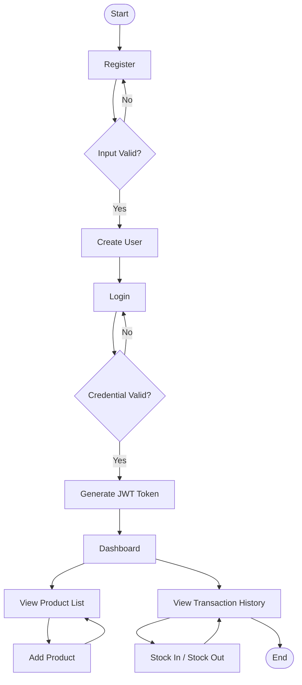
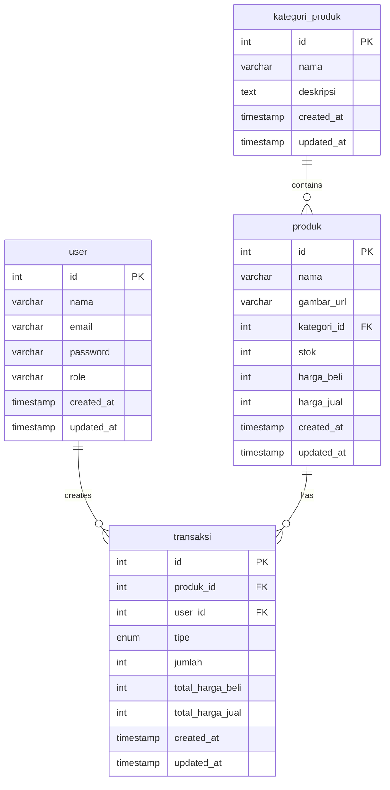

## User Requirement

#### Authentication
- User dapat melakukan **register** dengan email dan password
- User dapat **login** dengan email dan password
- Jika login berhasil, sistem akan memberikan **JWT token**
- User hanya bisa mengakses fitur utama setelah login

#### Dashboard
- Setelah login, user diarahkan ke halaman **dashboard**
- Di dashboard, user bisa memilih:
  - **Melihat daftar produk**
  - **Melihat riwayat transaksi**

#### Produk
- User dapat melihat daftar semua produk
- User dengan role admin dapat menambahkan produk baru
- Setelah produk ditambahkan, daftar produk akan diperbarui

#### Transaksi
- User dapat melihat riwayat transaksi masuk/keluar
- Admin dapat menambahkan transaksi baru (masuk / keluar stok)
- Setelah transaksi ditambahkan, riwayat akan diperbarui

## Flowchart

### ERD
